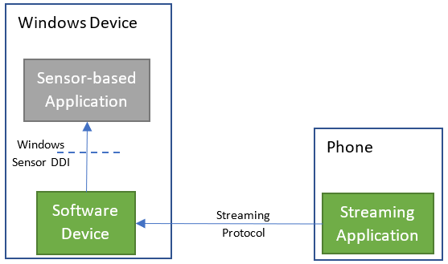

# RemoteSensorAccess

## Summary

Most Windows’ devices do not contain sensors of any type, except for camera. This means those devices cannot utilize any sensor-based applications (e.g. games like Subway Surfer). However, most people are carrying a phone that does.
The idea of this project is to expose a software sensor on the Windows device and then stream sensor data from a physical phone sensor to that software sensor.

This enables scenarios such as:

-	Usage of sensor-based applications on devices where it was previously not possible without any change to the application.
-	Usage of a phone as a controller for sensor-based applications, potential MyPhone integration.

## Remote Sensor Access Architecture

Most sensor-based applications use accelerometer and gyroscope so bring up of those sensors will occur for the purposes of this hackathon.

### Architecture Diagram

## Demo

Please see this project as a demo: https://github.com/BluBambu/RemoteMultiplayerTennis - users can use their phones to play virtual tennis.
